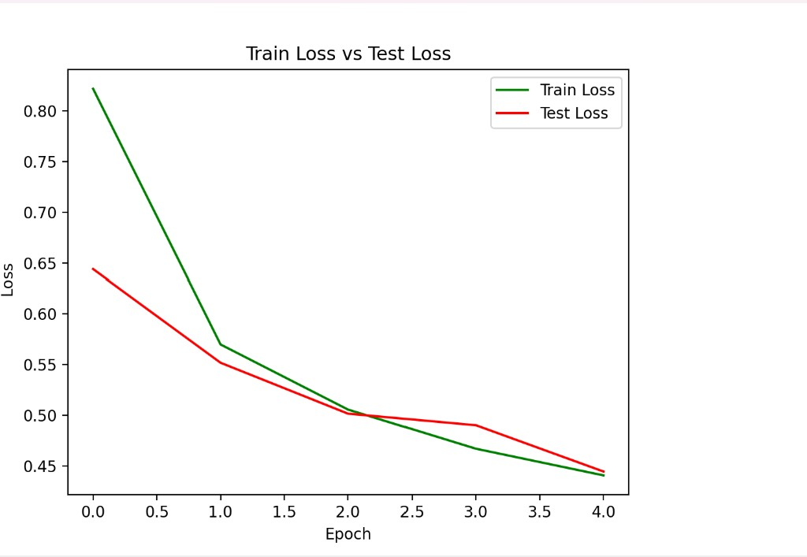
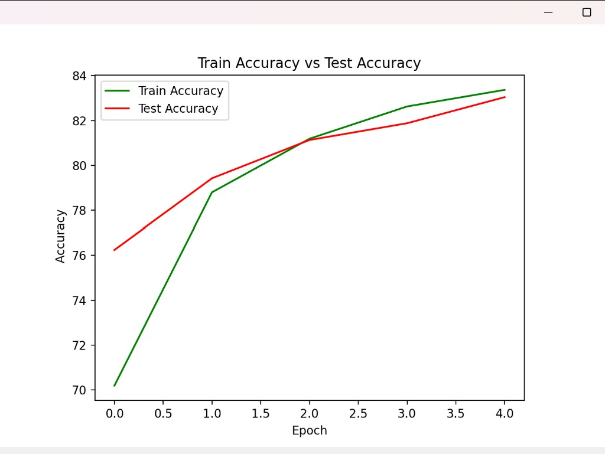

# FashionMNIST Image Classification (PyTorch)

Fashion-MNIST veri seti üzerinde evrişimli sinir ağı (CNN) ile giyim eşyası sınıflandırması. Model 5 epoch sonunda test setinde yaklaşık **%89.5** doğruluk elde eder.

## Özellikler

- Özel `FashionClassifierModel` mimarisi (2 conv bloğu + tam bağlı katman)
- Veri artırma: `TrivialAugmentWide`, yatay çevirme
- **TensorBoard** ile epoch bazlı loss / accuracy ve model grafiği
- Matplotlib ile eğitim grafikleri
- Yerel görsel ile tahmin (`ankle_bot.jpg`)

## Sınıflar

| # | Sınıf |
|---|--------|
| 0 | T-shirt/top |
| 1 | Trouser |
| 2 | Pullover |
| 3 | Dress |
| 4 | Coat |
| 5 | Sandal |
| 6 | Shirt |
| 7 | Sneaker |
| 8 | Bag |
| 9 | Ankle boot |

## Gereksinimler

- Python 3.10+
- PyTorch, torchvision ve bağımlılıklar (`requirements.txt`)

## Kurulum

```bash
git clone https://github.com/melikesoftware/Fashion-Mnist-CNN.git
cd Fashion-Mnist-CNN

python -m venv .venv
# Windows:
.venv\Scripts\activate
# macOS / Linux:
# source .venv/bin/activate

pip install -r requirements.txt
```

## Kullanım

```bash
python main.py
```

İlk çalıştırmada FashionMNIST veri seti `data/` klasörüne indirilir (repo’ya dahil değildir).

Kendi görselinizle tahmin için proje köküne bir `.jpg` dosyası koyun ve `main.py` içindeki `Image.open("ankle_bot.jpg")` satırındaki dosya adını değiştirin.

## Veri seti

[Fashion-MNIST](https://github.com/zalandoresearch/fashion-mnist) kullanılır (60.000 train + 10.000 test). Veri seti repoya yüklenmez; `python main.py` ile `data/FashionMNIST/` altına otomatik indirilir.

## TensorBoard

Eğitim sırasında her epoch sonunda train/test **Loss** ve **Accuracy** TensorBoard’a yazılır; eğitim bitince model grafiği de eklenir.

Log klasörü: `runs/fashion_experiment/`

**1.** Önce eğitimi çalıştırın (veya eğitim devam ederken):

```bash
python main.py
```

**2.** Ayrı bir terminalde TensorBoard’u başlatın:

```bash
# Windows (.venv aktifken):
tensorboard --logdir=runs/fashion_experiment

# veya tüm denemeler:
tensorboard --logdir=runs
```

**3.** Tarayıcıda açın: [http://localhost:6006](http://localhost:6006)

| Sekme | İçerik |
|--------|--------|
| SCALARS | `Loss/train_loss`, `Loss/test_loss`, `Accuracy/train_acc`, `Accuracy/test_acc` |
| GRAPHS | CNN mimarisi (`writer.add_graph`) |

`runs/` klasörü `.gitignore` içindedir (log dosyaları GitHub’a gitmez).

## Model özeti

| Metrik | Değer |
|--------|--------|
| Toplam parametre | 48,554 |
| Batch size | 32 |
| Epoch | 5 |
| Optimizer | Adam (lr=0.001) |
| Son test accuracy | ~89.55% |

## Eğitim sonuçları

5 epoch sonunda train ve test metrikleri birlikte iyileşir; loss düşer, accuracy artar.





## Proje yapısı

```
.
├── main.py           # Eğitim, TensorBoard, inference
├── ankle_bot.jpg     # Örnek test görseli
├── docs/             # Eğitim grafikleri (README)
├── runs/             # TensorBoard logları (.gitignore)
├── requirements.txt
└── data/             # FashionMNIST (.gitignore, otomatik indirilir)
```
